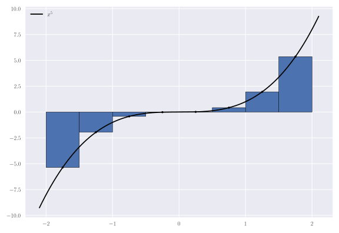

Calculate Riemann sums!

Graph Riemann sums!

...and maybe someday do that with more than just Riemann sums!

```python
from Interval import Interval, Method
from Quadrature import Riemann

#function to approximate
f = lambda x: x**3

#create interval from -2 to 2
i = Interval(-2,2)
print(i)
#[-2,2]

#partition the interval into 8 subintervals of equal width
i //= 8
print(i)
#[-2,2]
#  [-2,-1.5]
#  [-1.5,-1]
#  [-1,-0.5]
#  [-0.5,0]
#  [0,0.5]
#  [0.5,1]
#  [1,1.5]
#  [1.5,2]

#the method to choose points on the interval
m = Method.mid() #midpoint method

r = Riemann(f,i,m)

#calculate the Riemann sum
#should be ~0 because odd function
print(r.calc())
#0.0

#graphical representation of the sum
r.graph("Riemann.svg")
```


